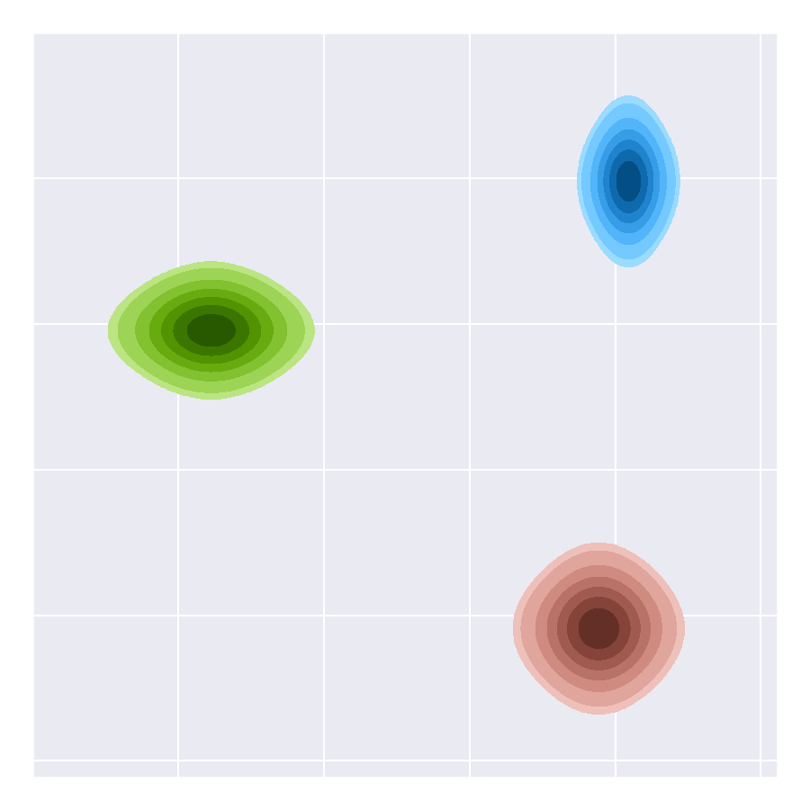
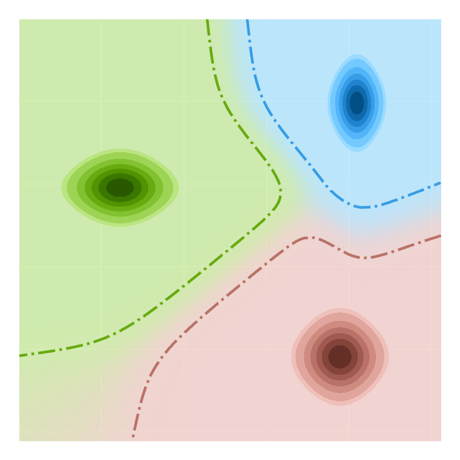
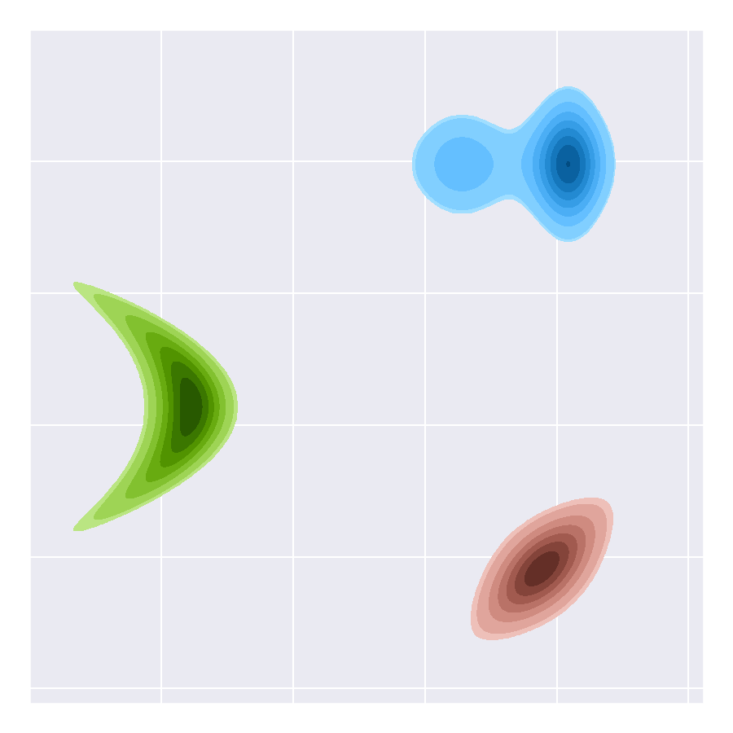
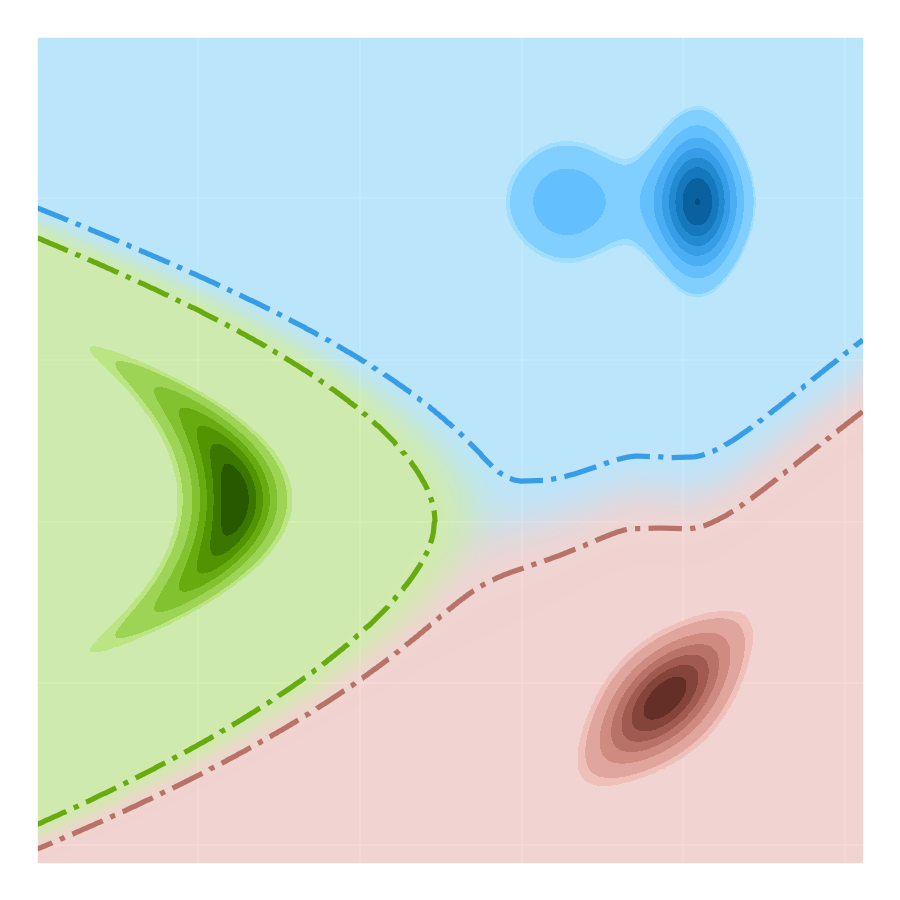
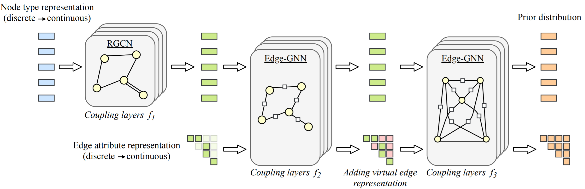

# Categorical Normalizing Flows
This repository is the official implementation of "[Categorical Normalizing Flows via Continuous Transformations](https://arxiv.org/abs/2006.09790)". Please note that this is a simplified re-implementation of the original code used for the paper, and hence the exact scores for specific seeds can slightly differ.

## Summary of the paper

### Abstract
Despite their popularity, to date, the application of normalizing flows on categoricaldata stays limited. The current practice of using dequantization to map discretedata to a continuous space is inapplicable as categorical data has no intrinsic order. Instead, categorical data have complex and latent relations that must be inferred, like the synonymy between words. In this paper, we investigate Categorical Normalizing Flows, that is normalizing flows for categorical data. By casting theencoding of categorical data in continuous space as a variational inference problem, we jointly optimize the continuous representation and the model likelihood. To maintain unique decoding, we learn a partitioning of the latent space by factorizing the posterior. Meanwhile, the complex relations between the categorical variables are learned by the ensuing normalizing flow, thus maintaining a close-to exact likelihood estimate and making it possible to scale up to a large number ofcategories. Based on Categorical Normalizing Flows, we propose GraphCNF apermutation-invariant generative model on graphs, outperforming both one-shotand autoregressive flow-based state-of-the-art on molecule generation.
  
### Visualizations

Encoding categorical data using variational inference allows flexible distributions. Below we visualized two encoding schemes with their corresponding partitioning of the latent space: a simple mixture model (left) and linear flows, i.e. mixtures with additional class-conditional flows (right). The distribution in continuous space is shown in different colors for three categories. The borders between categories indicate the part of the latent space where the decoding is almost deterministic (posterior probability > 0.95). Although the linear flows allow more flexible and hard borders between categories, we find that a mixture model is sufficient for the flow to accurately model discrete distributions.

|  |  |  |  | 
|:---:|:---:|:---:|:---:|

Based on such an encoding, GraphCNF is a normalizing flow on graphs which assigns equal probability to any permutation of nodes. Most current approaches are autoregressive and assume an order of nodes although any permutation of nodes represents the exact same graph. GraphCNF encodes the node types, edge attributes and binary adjacency matrix in three steps into latent space. This stepwise encoding strategy makes the flow more efficient as it reduces the network sizes and number of transformations applied, and allows coupling layers to leverage the graph structure earlier when generating.



## Requirements

The code is written in PyTorch (1.4) and Python 3.6. Higher versions of PyTorch and Python are expected to work as well.

We recommend to use conda for installing the requirements. If you haven't installed conda yet, you can find instructions [here](https://www.anaconda.com/products/individual). The steps for installing the requirements are:

1. Create a new environment
   ```setup
   conda create env -n CNF
   ```
   In the environment, a python version >3.6 should be used.
   
2. Activate the environment
   ```setup
   conda activate CNF
   ```
   
3. Install the requirements within the environment via pip:
   ```setup
   pip install -r requirements.txt
   ```
   In case you have a GPU, make sure you install PyTorch with GPU support (see the [official website](https://pytorch.org/) for details).
   Some requirements are only necessary for specific experiments, and can be left out if wanted:
   * _CairoSVG_ (used for converting SVG images of molecules to PDFs)
   * _ortools_ (only needed for generating a new graph coloring dataset)
   * _torchtext_ (used for downloading and managing datasets in language modeling experiments)
   
4. (Optional) Install [RDKit](https://www.rdkit.org/docs/Install.html) for evaluating and visualizing molecules:
   ```
   conda install -c rdkit rdkit
   ```
   This step can be skipped in case you do not want to run experiments on molecule generation. 


Experiments have been performed on a NVIDIA GTX 1080Ti and TitanRTX with 11GB and 24GB of memory respectively. The experiments on the TitanRTX can also be run on a smaller GPU such as the GTX 1080Ti with smaller batch sizes. The results are expected to be similar while requiring slightly longer training. 


## Repository organization

The code is split into three main parts by folders:
* [general](general/) summarizes files that are needed for code infrastructure, as functions for loading/saving a model and a template for a training loop.
* [experiments](experiments/) includes the task-specific code for the four experiment domains.
* [layers](layers/) contains the implementation of network layers and flow transformations, such as mixture coupling layers, Edge-GNN and the encoding of categorical variables into continuous space. 

### Training and Evaluation

We provide training and evaluation scripts for all four experiments in the paper: set modeling, graph coloring, molecule generation and language modeling. The detailed description for running an experiment can be found in the corresponding experiment folder: [set modeling](experiments/set_modeling/), [graph coloring](experiments/graph_coloring/), [molecule generation](experiments/molecule_generation/) and [language modeling](experiments/language_modeling/).

### Datasets

We provide preprocessed datasets for the graph coloring and molecule generation experiments, which can be found [here](https://drive.google.com/drive/folders/1naWHSNb1rYd72MuMuIQlolD16pcy7uue?usp=sharing). The data for the experiments should be placed at `experiment/_name_/data/`. 

For set modeling, the datasets are generated during training and do not require a saved file. The datasets for the language experiments are managed by torchtext and automatically downloaded when running the experiments for the first time.

## Results and Pretrained models

We uploaded pretrained models for most of the experiments in the paper [here](https://drive.google.com/drive/folders/1G06xnYE9aYukwxy7Fx4rPlc2HL_GthAJ?usp=sharing).
We also provide a tensorboard with every pretrained model to show the training progress.
Please refer to the experiment folders for loading and evaluating such models.

### Set modeling

#### Set shuffling dataset

| Model | Bits per variable |
|---|---|
| Discrete NF | 3.87bpd |
| Variational Dequantization | 3.01bpd |
| CNF + Mixture model ([pretrained](https://drive.google.com/drive/folders/1qm14bWvvLtusQEDPZZKc4j3rW0a3y58X?usp=sharing)) | 2.78bpd |
| CNF + Linear flows | 2.78bpd |
| CNF + Variational encoding | 2.79bpd |
| Optimum | 2.77bpd |

#### Set summation dataset

| Model | Bits per variable |
|---|---|
| Discrete NF | 2.51bpd |
| Variational Dequantization | 2.29bpd |
| CNF + Mixture model ([pretrained](https://drive.google.com/drive/folders/1CVjQqO6YElnO9LdXh-k7Q-HaJgZEyHPA?usp=sharing)) | 2.24bpd |
| CNF + Linear flows | 2.25bpd |
| CNF + Variational encoding | 2.25bpd |
| Optimum | 2.24bpd |

### Graph coloring

| Model | Validity | Bits per variable |
|---|:---:|:---:|
| VAE ([pretrained](https://drive.google.com/drive/folders/14EQRS8ShadKBHe-1WOnWjGHQ2X4YL2OV?usp=sharing)) | 7.75% | 0.64bpd |
| RNN + Smallest_first ([pretrained](https://drive.google.com/drive/folders/1FyV-2GJEv11mU7X4NT855UhgnN0aZec8?usp=sharing)) | 32.27% | 0.50bpd |
| RNN + Random ([pretrained](https://drive.google.com/drive/folders/1pe97QNGea4r1W3db6o49wzKp3nlkDaZh?usp=sharing)) | 49.28%  | 0.46bpd |
| RNN + Largest_first ([pretrained](https://drive.google.com/drive/folders/1ckNXUoRvY0YwGU2QehO-DcwWZi3pisAZ?usp=sharing)) | 71.32% | 0.43bpd |
| GraphCNF ([pretrained](https://drive.google.com/drive/folders/1b4EENKqkAxq5sRtY0bgKsrb5Atj8i65U?usp=sharing)) | 66.80% | 0.45bpd |


### Molecule generation

#### Zinc250k dataset

| Model | Validity | Uniqueness | Novelty | Bits per node |
|---|:---:|:---:|:---:|:---:|
| GraphCNF ([pretrained](https://drive.google.com/drive/folders/10gUUf5eEzHtmB37TamfFamLeCeK6J5WH?usp=sharing)) | 83.41% | 99.99% | 100% | 5.17bpd |
| + Subgraphs | 96.35% | 99.98% | 100% |  |

#### Moses dataset

| Model | Validity | Uniqueness | Novelty | Bits per node |
|---|:---:|:---:|:---:|:---:|
| GraphCNF ([pretrained](https://drive.google.com/drive/folders/1LNVMG5hTdcrTKlZHzVnDrjJEY_hHBEjR?usp=sharing)) | 82.56% | 100% | 100% | 4.94bpd |
| + Subgraphs | 95.66% | 99.98% | 100% |  |

### Language modeling

| Model | Penn-Treebank | Text8 | Wikitext103 |
|---|---|---|---|
| LSTM baseline | 1.28bpd | 1.44bpd | 4.81bpd |
| Categorical Normalizing Flow | 1.27bpd | 1.45bpd | 5.43bpd |

## Contributing

All content in this repository is licensed under the MIT license. Please feel free to raise any issue if the code is not working properly.

### Adding a new experiment

This code is designed to be easily extended to new tasks and datasets.
For details on how to add a new experiment task, see the README in the experiments folder.

