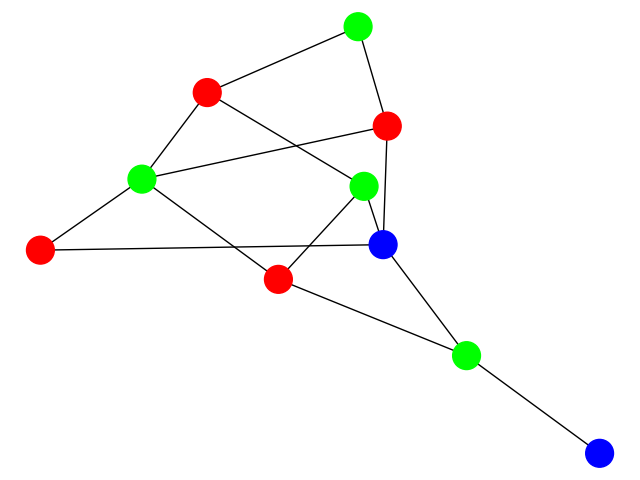
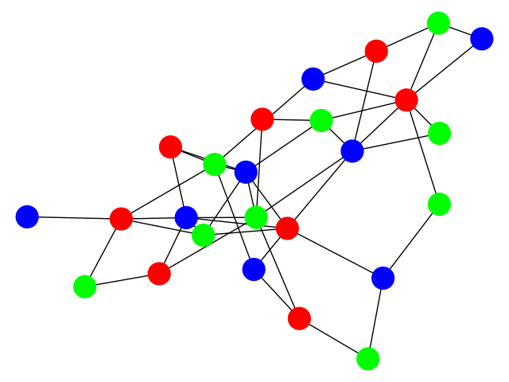
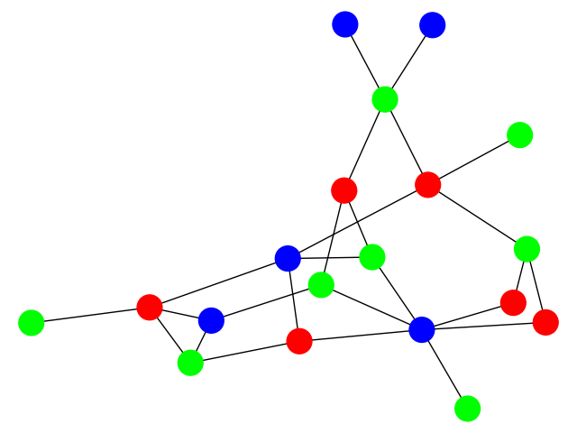
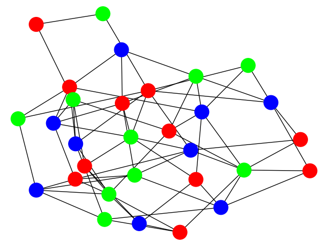

# Graph coloring

This experiment folder summarizes the experiments on graph coloring. 

## Datasets

The datasets used in the paper can be found [here](https://drive.google.com/drive/folders/1Z2VFdrhYEiYXWsQIZMSMKBXvhYkgmhY7?usp=sharing) and should be placed in the `data/` folder. The code that has been used to generate these dataset is located at [datasets/graph_coloring_generation.py](datasets/graph_coloring_generation.py).

We used two datasets, one with graphs of size 10<|V|<20, and a second, larger one with 25<|V|<50. The smaller dataset is split into 192k/24k/24k graphs for train/val/test, and the larger dataset into 450k/20k/30k. Both datasets use 3 colors, but the provided generation file supports also different colorings. Examples of the dataset are visualized below.

| 10<V<20 | 25<V<50 |
|:---:|:---:|
|  |  |
|  |  |

## Training

To train a Categorical Normalizing Flow on the large dataset of graph coloring, use the following command:
```
python train.py --dataset large_3 \
                --max_iterations 200000 \
                --batch_size 128 \
                --encoding_dim 6 \
                --coupling_num_mixtures 16 \
                --optimizer 4 \
                --learning_rate 7.5e-4 \
                --checkpoint_path checkpoints/large_3_CNF/ \
                --cluster
```
The argument `--checkpoint_path` specifies the folder in which the checkpoints and tensorboard should be saved, and can be changed freely. The `--cluster` argument is set to reduce the printed output to stdout for longer experiments.
For training the model on the smaller dataset, use the following command:
```
python train.py --dataset tiny_3 \
                --max_iterations 200000 \
                --batch_size 384 \
                --encoding_dim 2 \
                --coupling_num_mixtures 8 \
                --optimizer 4 \
                --learning_rate 7.5e-4 \
                --checkpoint_path checkpoints/tiny_3_CNF/ \
                --cluster
```
The batch sizes were picked to run on a NVIDIA TitanRTX GPU with 24GB of memory (uses about 20GB). The batch size can be limited to a lower size to reduce the memory footprint. Experiments on RNNs and VAEs can be run on a NVIDIA GTX 1080Ti with 11GB.

A recurrent neural network can be trained on graph coloring by running:
```
python train.py --dataset large_3 \
                --max_iterations 100000 \
                --batch_size 128 \
                --eval_freq 25000 \
                --use_rnn \
                --rnn_graph_ordering rand \
                --coupling_hidden_layers 5 \
                --optimizer 4 \
                --learning_rate 7.5e-4 \
                --checkpoint_path checkpoints/large_3_RNN_rand/ \
                --cluster
```
The node ordering is set via the argument `--rnn_graph_ordering` which supports _rand_, _smallest_first_ and _largest_first_. We recommend to set the evaluation frequency (i.e. after how many training iterations to perform the evaluation) higher as sampling is slow with recurrent neural network.

For training a VAE, please use:
```
python train.py --dataset large_3 \
                --max_iterations 100000 \
                --batch_size 128 \
                --eval_freq 25000 \
                --use_VAE \
                --coupling_hidden_layers 5 \
                --optimizer 4 \
                --learning_rate 7.5e-4 \
                --checkpoint_path checkpoints/large_3_VAE/ \
                --cluster
```

## Evaluation

All models can be evaluated with the same command:
```
python eval.py --checkpoint_path path_to_folder
```
where `path_to_folder` should be replaced with the path to the actual folder with the checkpoints. The evaluation script applies the saved model to the test set and saves the results in the file `eval_metrics.json`.

## Pretrained models

Pretrained models for set modeling can be found [here](https://drive.google.com/drive/folders/1YblAQZoVKv69fuGi-bleFYMX1KUXAfkr?usp=sharing). After downloading the model folders, place them inside the `checkpoints` folder (for instance, `checkpoints/large_3_CNF`. You can evaluate the pretrained models by running the evaluation script:

```
python eval.py --checkpoint_path checkpoints/large_3_CNF/
```

## Results

### Graph coloring

| Model | Validity (reported) | Validity (pretrained) | Bits per variable |
|---|:---:|:---:|:---:|
| VAE ([pretrained](https://drive.google.com/drive/folders/14EQRS8ShadKBHe-1WOnWjGHQ2X4YL2OV?usp=sharing)) | 7.75% | 8.12% | 0.64bpd |
| RNN + Smallest_first ([pretrained](https://drive.google.com/drive/folders/1FyV-2GJEv11mU7X4NT855UhgnN0aZec8?usp=sharing)) | 32.27% | 31.58% | 0.50bpd |
| RNN + Random ([pretrained](https://drive.google.com/drive/folders/1pe97QNGea4r1W3db6o49wzKp3nlkDaZh?usp=sharing)) | 49.28% | 54.02% | 0.46bpd |
| RNN + Largest_first ([pretrained](https://drive.google.com/drive/folders/1ckNXUoRvY0YwGU2QehO-DcwWZi3pisAZ?usp=sharing)) | 71.32% | 70.51% | 0.43bpd |
| GraphCNF ([pretrained](https://drive.google.com/drive/folders/1b4EENKqkAxq5sRtY0bgKsrb5Atj8i65U?usp=sharing)) | 66.80% | 66.81% | 0.45bpd |

The pretrained models have been trained on the seed 42. The reported scores were averaged over the seed 42, 43 and 44 with a different code base and therefore slightly differ here.
