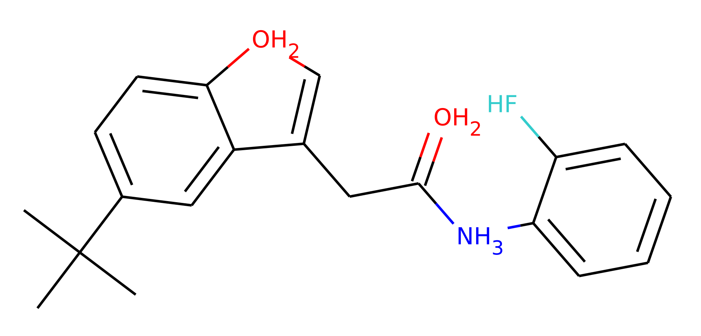
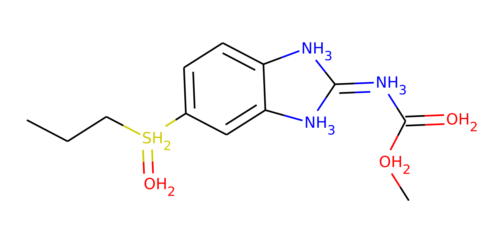
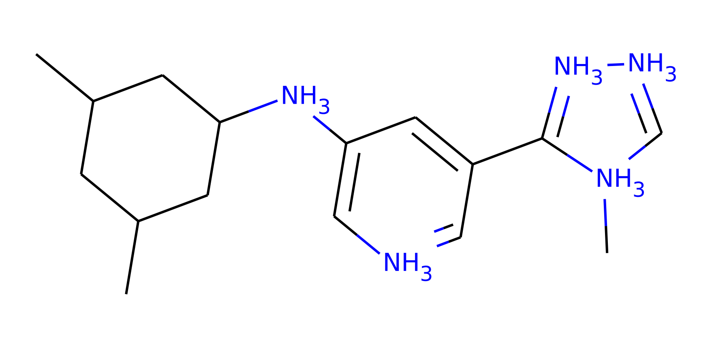
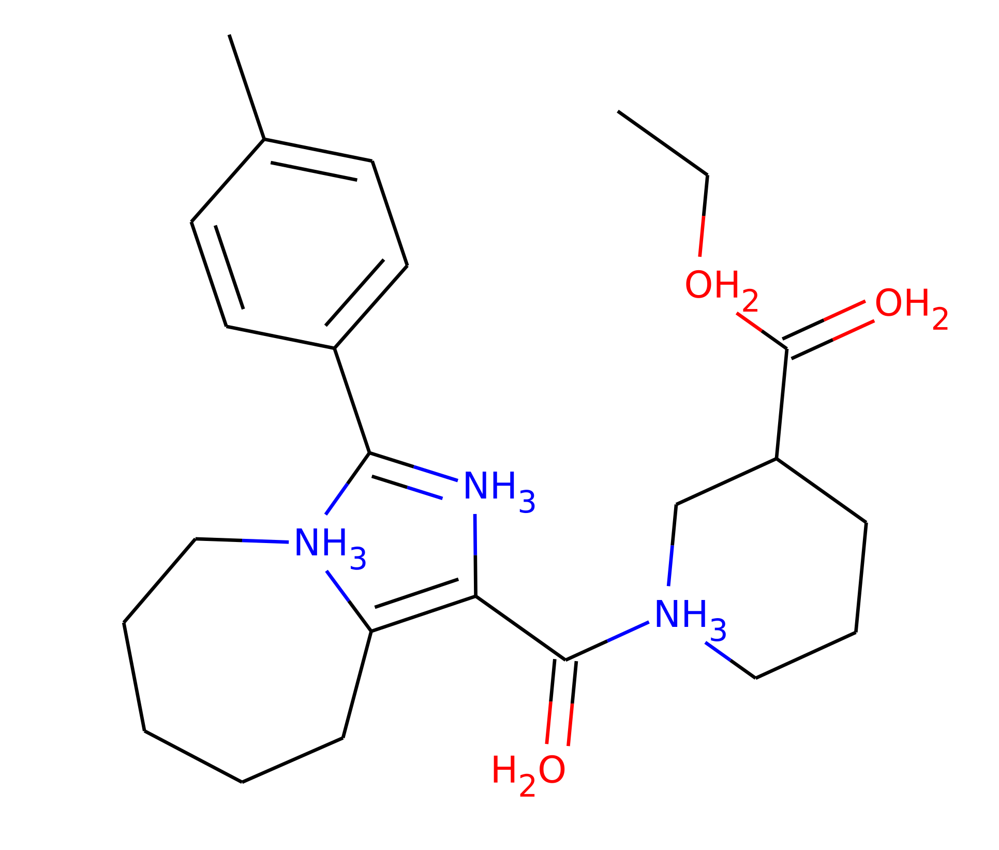
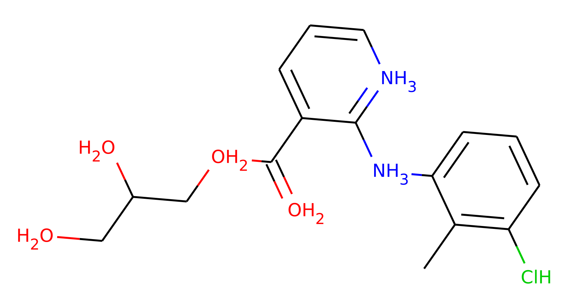
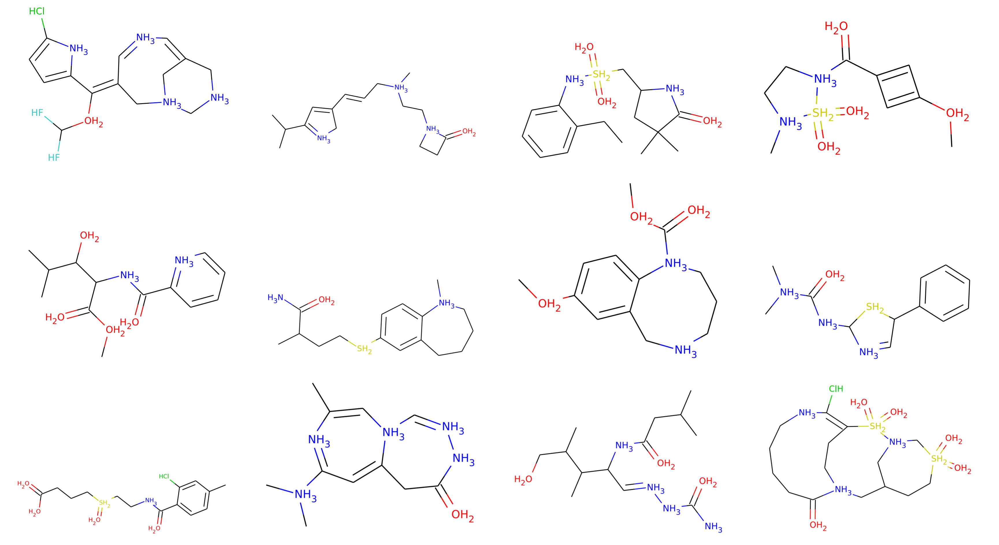

# Molecule generation

This experiment folder summarizes the experiments on molecule generation. 

## Datasets

We provide scripts to run experiments on the two datasets Zinc250k and Moses. Before running any experiments, please download the preprocessed [datasets](https://drive.google.com/drive/folders/1QApbfPAS4AYVNTuEmbYBPovj0E8PT0pP?usp=sharing), and place them inside the `data/` folder (i.e. `data/moses/` and `data/zinc250k/`). In case you only want to run an experiment on one of the two datasets, it is sufficient to download the respective folder and ignore the other dataset.

Example molecules of both datasets can be seen below. Both dataset files contain code for visualizing and plotting molecules.
| Zinc250k | Moses |
|:---:|:---:|
|  |  |
|  |  |
|  |  | 

## Training

To train GraphCNF on Zinc250k, use the following command:
```
python train.py --dataset zinc250k \
                --max_iterations 150000 \
                --batch_size 64 \
                --encoding_dim_nodes 6 \
                --encoding_dim_edges 2 \
                --optimizer 4 \
                --learning_rate 5e-4 \
                --checkpoint_path checkpoints/GraphCNF_zinc250k/ \
                --cluster
```
For training the model on Moses, replace `--dataset zinc250k` with `--dataset moses` and increase the batch size 96. The `--cluster` argument is set to reduce the printed output to stdout for longer experiments.

## Evaluation

GraphCNF can be evaluated by:
```
python eval.py --checkpoint_path path_to_folder
```
where `path_to_folder` should be replaced with the path to the actual folder with the checkpoints. The evaluation script applies the saved model to the test set and samples 10k new molecule examples from the model. The final performance on all metrics is saved in the file `eval_metrics.json`.

## Pretrained models

Pretrained models of GraphCNF can be found [here](https://drive.google.com/drive/folders/1F-boW5qV7T3okDCQN9_lwgtzTgWtq7H3?usp=sharing). After downloading the model folders, place them inside the `checkpoints` folder (for instance, `checkpoints/GraphCNF`. You can evaluate the pretrained models by running the evaluation script:

```
python eval.py --checkpoint_path checkpoints/GraphCNF/
```

## Results

### Zinc250k

| Model | Validity | Uniqueness | Novelty | Bits per node |
|---|:---:|:---:|:---:|:---:|
| GraphCNF ([pretrained](https://drive.google.com/drive/folders/1F-boW5qV7T3okDCQN9_lwgtzTgWtq7H3?usp=sharing)) | 83.41% | 99.99% | 100% | 5.27bpd |
| + Subgraphs | 96.35% | 99.98% | 100% |  |

### Moses

| Model | Validity | Uniqueness | Novelty | Bits per node |
|---|:---:|:---:|:---:|:---:|
| GraphCNF ([pretrained](https://drive.google.com/drive/folders/1F-boW5qV7T3okDCQN9_lwgtzTgWtq7H3?usp=sharing)) | 82.56% | 100% | 100% | 4.94bpd |
| + Subgraphs | 95.66% | 99.98% | 100% |  |

### Example generations

